# Dursor 設計書

本ドキュメントは dursor の設計を詳細に記述します。

## 目次

1. [システム概要](#1-システム概要)
2. [アーキテクチャ概観](#2-アーキテクチャ概観)
3. [バックエンド設計](#3-バックエンド設計)
4. [フロントエンド設計](#4-フロントエンド設計)
5. [ドメインモデル](#5-ドメインモデル)
6. [データフロー](#6-データフロー)
7. [API設計](#7-api設計)
8. [セキュリティ設計](#8-セキュリティ設計)
9. [インフラストラクチャ](#9-インフラストラクチャ)
10. [制限事項とロードマップ](#10-制限事項とロードマップ)

---

## 1. システム概要

### 1.1 プロジェクト概要

**dursor** は、セルフホスト可能なマルチモデル並列コーディングエージェントです。

### 1.2 主要コンセプト

| コンセプト | 説明 |
|-----------|------|
| **BYO API Key** | ユーザーが自身のAPI キー（OpenAI/Anthropic/Google）を持ち込む |
| **マルチモデル並列実行** | 同一タスクを複数モデルで同時実行し、結果を比較可能 |
| **会話駆動型PR開発** | チャットインタラクションを通じてPRを段階的に構築 |

### 1.3 技術スタック概要

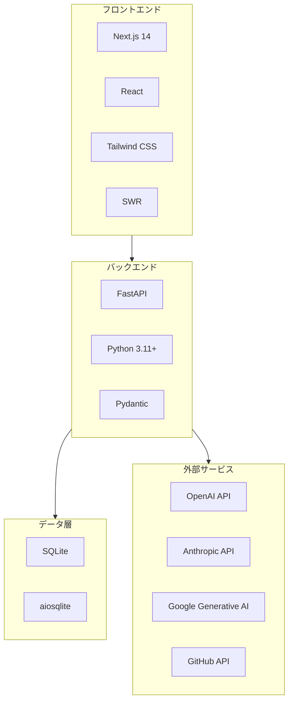
```mermaid
graph TB
    subgraph Frontend["フロントエンド"]
        Next["Next.js 14"]
        React["React"]
        Tailwind["Tailwind CSS"]
        SWR["SWR"]
    end

    subgraph Backend["バックエンド"]
        FastAPI["FastAPI"]
        Python["Python 3.11+"]
        Pydantic["Pydantic"]
    end

    subgraph Data["データ層"]
        SQLite["SQLite"]
        aiosqlite["aiosqlite"]
    end

    subgraph External["外部サービス"]
        OpenAI["OpenAI API"]
        Anthropic["Anthropic API"]
        Google["Google Generative AI"]
        GitHub["GitHub API"]
    end

    Frontend --> Backend
    Backend --> Data
    Backend --> External
```

---

## 2. アーキテクチャ概観

### 2.1 システム構成図

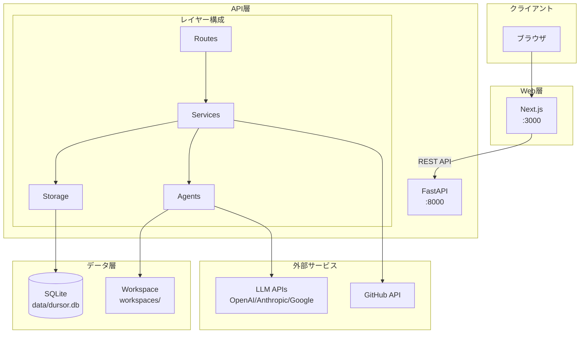
```mermaid
flowchart TB
    subgraph Client["クライアント"]
        Browser["ブラウザ"]
    end

    subgraph WebTier["Web層"]
        NextJS["Next.js<br/>:3000"]
    end

    subgraph APITier["API層"]
        FastAPI["FastAPI<br/>:8000"]

        subgraph Layers["レイヤー構成"]
            Routes["Routes"]
            Services["Services"]
            Agents["Agents"]
            Storage["Storage"]
        end
    end

    subgraph DataTier["データ層"]
        SQLiteDB[("SQLite<br/>data/dursor.db")]
        Workspace["Workspace<br/>workspaces/"]
    end

    subgraph ExternalServices["外部サービス"]
        LLM["LLM APIs<br/>OpenAI/Anthropic/Google"]
        GitHubAPI["GitHub API"]
    end

    Browser --> NextJS
    NextJS -->|REST API| FastAPI

    Routes --> Services
    Services --> Agents
    Services --> Storage

    Storage --> SQLiteDB
    Agents --> Workspace
    Agents --> LLM
    Services --> GitHubAPI
```

### 2.2 レイヤーアーキテクチャ

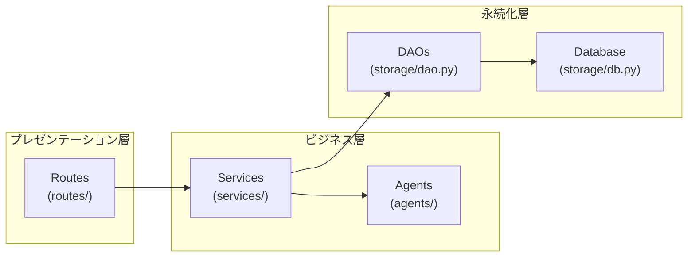
```mermaid
flowchart LR
    subgraph Presentation["プレゼンテーション層"]
        Routes["Routes<br/>(routes/)"]
    end

    subgraph Business["ビジネス層"]
        Services["Services<br/>(services/)"]
        Agents["Agents<br/>(agents/)"]
    end

    subgraph Persistence["永続化層"]
        DAO["DAOs<br/>(storage/dao.py)"]
        DB["Database<br/>(storage/db.py)"]
    end

    Routes --> Services
    Services --> Agents
    Services --> DAO
    DAO --> DB
```

| レイヤー | 責務 |
|---------|------|
| **Routes** | HTTP リクエストの受信、バリデーション、レスポンス整形 |
| **Services** | ビジネスロジック、トランザクション管理、複数DAOの調整 |
| **Agents** | LLMとのインタラクション、パッチ生成 |
| **DAO** | データアクセス抽象化、CRUD操作 |
| **Database** | SQLite接続管理、スキーマ初期化 |

---

## 3. バックエンド設計

### 3.1 ディレクトリ構成

```
apps/api/src/dursor_api/
├── main.py             # FastAPIエントリーポイント
├── config.py           # 設定（環境変数）
├── dependencies.py     # 依存性注入
├── agents/             # エージェント実装
│   ├── base.py         # BaseAgent 抽象クラス
│   ├── llm_router.py   # LLMクライアント
│   └── patch_agent.py  # パッチ生成エージェント
├── domain/             # ドメインモデル
│   ├── enums.py        # 列挙型
│   └── models.py       # Pydanticモデル
├── routes/             # APIルート
│   ├── github.py       # /v1/github
│   ├── models.py       # /v1/models
│   ├── repos.py        # /v1/repos
│   ├── tasks.py        # /v1/tasks
│   ├── runs.py         # /v1/runs
│   └── prs.py          # /v1/prs
├── services/           # ビジネスロジック
│   ├── crypto_service.py
│   ├── model_service.py
│   ├── repo_service.py
│   ├── run_service.py
│   ├── pr_service.py
│   └── github_service.py
└── storage/            # データ永続化
    ├── schema.sql      # SQLiteスキーマ
    ├── db.py           # DB接続
    └── dao.py          # Data Access Objects
```

### 3.2 設定管理 (config.py)

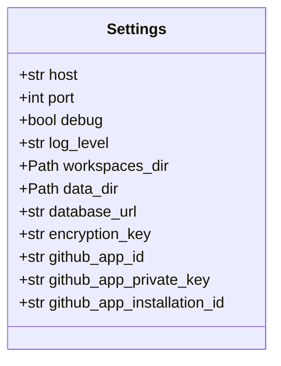
```mermaid
classDiagram
    class Settings {
        +str host
        +int port
        +bool debug
        +str log_level
        +Path workspaces_dir
        +Path data_dir
        +str database_url
        +str encryption_key
        +str github_app_id
        +str github_app_private_key
        +str github_app_installation_id
    }
```

環境変数は `DURSOR_` プレフィックスで読み込まれます。

### 3.3 サービス層

#### 3.3.1 サービス一覧

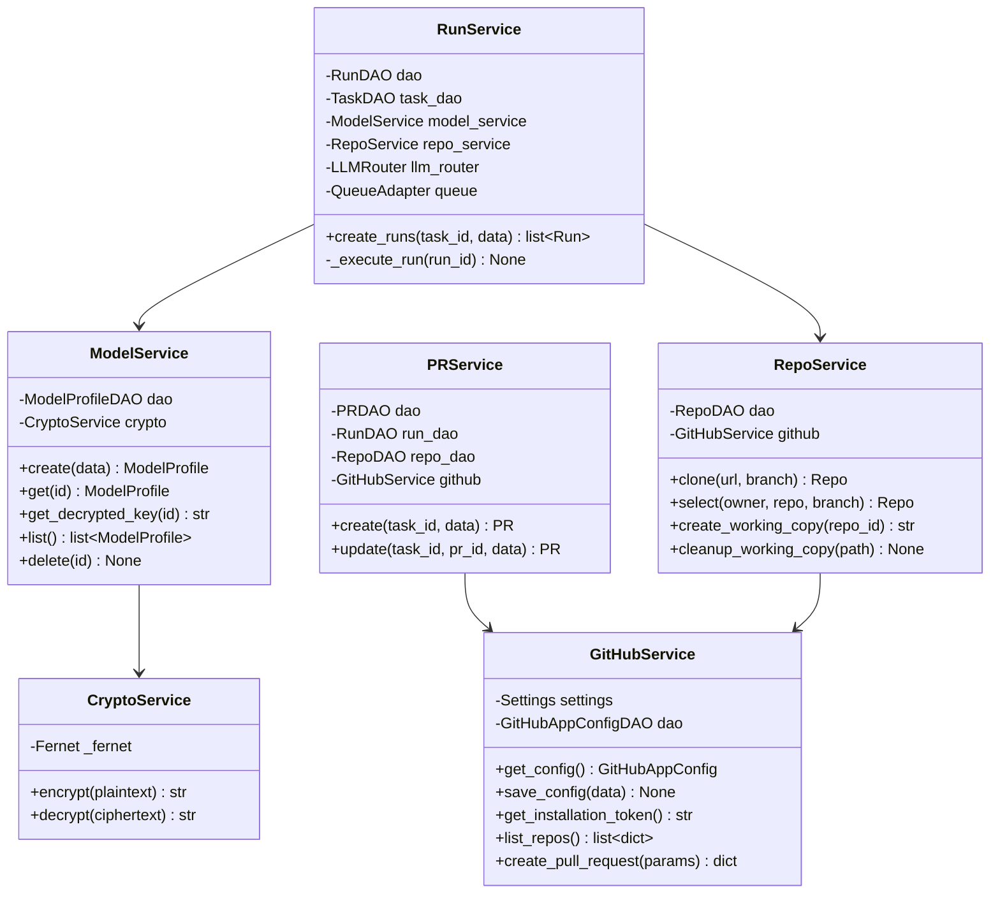
```mermaid
classDiagram
    class CryptoService {
        -Fernet _fernet
        +encrypt(plaintext) str
        +decrypt(ciphertext) str
    }

    class ModelService {
        -ModelProfileDAO dao
        -CryptoService crypto
        +create(data) ModelProfile
        +get(id) ModelProfile
        +get_decrypted_key(id) str
        +list() list~ModelProfile~
        +delete(id) None
    }

    class RepoService {
        -RepoDAO dao
        -GitHubService github
        +clone(url, branch) Repo
        +select(owner, repo, branch) Repo
        +create_working_copy(repo_id) str
        +cleanup_working_copy(path) None
    }

    class RunService {
        -RunDAO dao
        -TaskDAO task_dao
        -ModelService model_service
        -RepoService repo_service
        -LLMRouter llm_router
        -QueueAdapter queue
        +create_runs(task_id, data) list~Run~
        -_execute_run(run_id) None
    }

    class PRService {
        -PRDAO dao
        -RunDAO run_dao
        -RepoDAO repo_dao
        -GitHubService github
        +create(task_id, data) PR
        +update(task_id, pr_id, data) PR
    }

    class GitHubService {
        -Settings settings
        -GitHubAppConfigDAO dao
        +get_config() GitHubAppConfig
        +save_config(data) None
        +get_installation_token() str
        +list_repos() list~dict~
        +create_pull_request(params) dict
    }

    ModelService --> CryptoService
    RunService --> ModelService
    RunService --> RepoService
    PRService --> GitHubService
    RepoService --> GitHubService
```

#### 3.3.2 実行キュー (QueueAdapter)

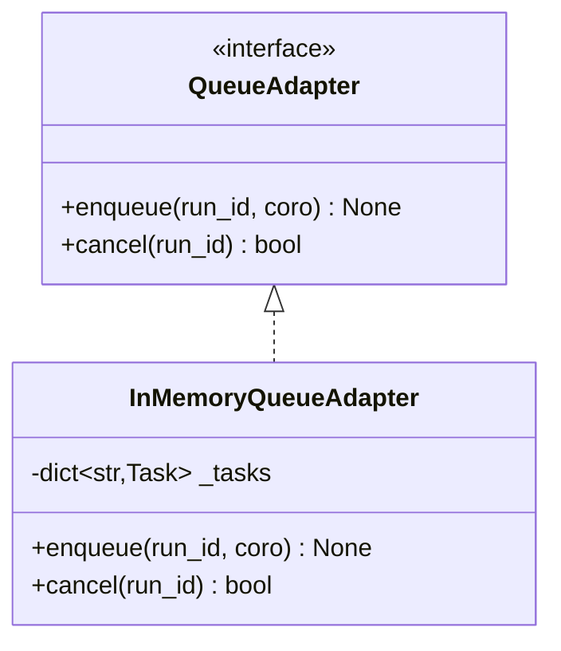
```mermaid
classDiagram
    class QueueAdapter {
        <<interface>>
        +enqueue(run_id, coro) None
        +cancel(run_id) bool
    }

    class InMemoryQueueAdapter {
        -dict~str,Task~ _tasks
        +enqueue(run_id, coro) None
        +cancel(run_id) bool
    }

    QueueAdapter <|.. InMemoryQueueAdapter
```

v0.1では非同期タスクキューをメモリ内で管理しています。サーバー再起動で実行中のタスクは失われます。

### 3.4 エージェント層

#### 3.4.1 エージェントクラス図

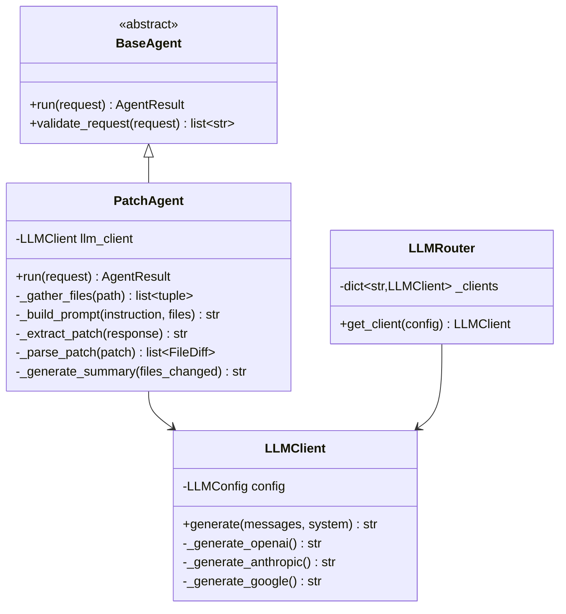
```mermaid
classDiagram
    class BaseAgent {
        <<abstract>>
        +run(request) AgentResult
        +validate_request(request) list~str~
    }

    class PatchAgent {
        -LLMClient llm_client
        +run(request) AgentResult
        -_gather_files(path) list~tuple~
        -_build_prompt(instruction, files) str
        -_extract_patch(response) str
        -_parse_patch(patch) list~FileDiff~
        -_generate_summary(files_changed) str
    }

    class LLMRouter {
        -dict~str,LLMClient~ _clients
        +get_client(config) LLMClient
    }

    class LLMClient {
        -LLMConfig config
        +generate(messages, system) str
        -_generate_openai() str
        -_generate_anthropic() str
        -_generate_google() str
    }

    BaseAgent <|-- PatchAgent
    PatchAgent --> LLMClient
    LLMRouter --> LLMClient
```

#### 3.4.2 PatchAgent処理フロー

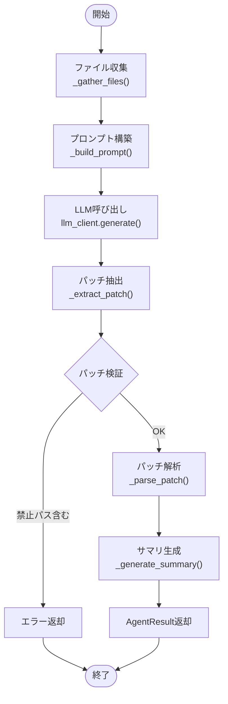
```mermaid
flowchart TD
    Start([開始]) --> GatherFiles["ファイル収集<br/>_gather_files()"]
    GatherFiles --> BuildPrompt["プロンプト構築<br/>_build_prompt()"]
    BuildPrompt --> CallLLM["LLM呼び出し<br/>llm_client.generate()"]
    CallLLM --> ExtractPatch["パッチ抽出<br/>_extract_patch()"]
    ExtractPatch --> ValidatePatch{"パッチ検証"}

    ValidatePatch -->|禁止パス含む| Error["エラー返却"]
    ValidatePatch -->|OK| ParsePatch["パッチ解析<br/>_parse_patch()"]

    ParsePatch --> GenerateSummary["サマリ生成<br/>_generate_summary()"]
    GenerateSummary --> Return["AgentResult返却"]

    Error --> End([終了])
    Return --> End
```

#### 3.4.3 マルチプロバイダー対応 (LLMClient)

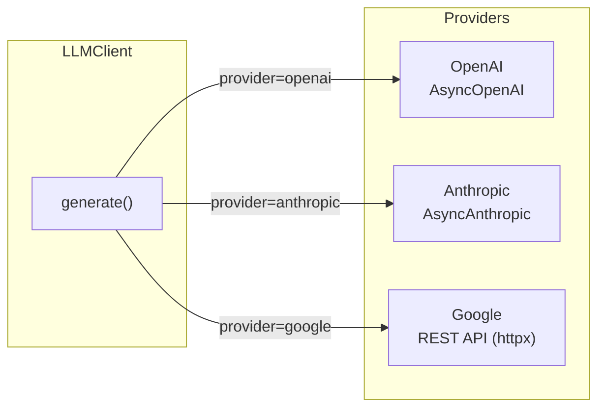
```mermaid
flowchart LR
    subgraph LLMClient
        Generate["generate()"]
    end

    subgraph Providers
        OpenAI["OpenAI<br/>AsyncOpenAI"]
        Anthropic["Anthropic<br/>AsyncAnthropic"]
        Google["Google<br/>REST API (httpx)"]
    end

    Generate -->|provider=openai| OpenAI
    Generate -->|provider=anthropic| Anthropic
    Generate -->|provider=google| Google
```

| プロバイダー | SDK | 特記事項 |
|-------------|-----|---------|
| OpenAI | `AsyncOpenAI` | gpt-5-mini は `max_completion_tokens` を使用 |
| Anthropic | `AsyncAnthropic` | システムプロンプトをネイティブサポート |
| Google | `httpx` (REST) | 非同期SDKがないためREST API直接呼び出し |

### 3.5 ストレージ層

#### 3.5.1 DAOクラス図

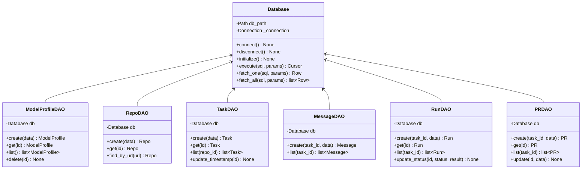
```mermaid
classDiagram
    class Database {
        -Path db_path
        -Connection _connection
        +connect() None
        +disconnect() None
        +initialize() None
        +execute(sql, params) Cursor
        +fetch_one(sql, params) Row
        +fetch_all(sql, params) list~Row~
    }

    class ModelProfileDAO {
        -Database db
        +create(data) ModelProfile
        +get(id) ModelProfile
        +list() list~ModelProfile~
        +delete(id) None
    }

    class RepoDAO {
        -Database db
        +create(data) Repo
        +get(id) Repo
        +find_by_url(url) Repo
    }

    class TaskDAO {
        -Database db
        +create(data) Task
        +get(id) Task
        +list(repo_id) list~Task~
        +update_timestamp(id) None
    }

    class MessageDAO {
        -Database db
        +create(task_id, data) Message
        +list(task_id) list~Message~
    }

    class RunDAO {
        -Database db
        +create(task_id, data) Run
        +get(id) Run
        +list(task_id) list~Run~
        +update_status(id, status, result) None
    }

    class PRDAO {
        -Database db
        +create(task_id, data) PR
        +get(id) PR
        +list(task_id) list~PR~
        +update(id, data) None
    }

    Database <-- ModelProfileDAO
    Database <-- RepoDAO
    Database <-- TaskDAO
    Database <-- MessageDAO
    Database <-- RunDAO
    Database <-- PRDAO
```

---

## 4. フロントエンド設計

### 4.1 ディレクトリ構成

```
apps/web/src/
├── app/                    # App Router
│   ├── layout.tsx          # ルートレイアウト
│   ├── page.tsx            # ホームページ
│   ├── settings/           # 設定ページ
│   └── tasks/
│       └── [taskId]/       # タスク詳細ページ
│           └── page.tsx
├── components/             # Reactコンポーネント
│   ├── ChatPanel.tsx       # チャットパネル
│   ├── RunDetailPanel.tsx  # 実行詳細パネル
│   ├── DiffViewer.tsx      # Diffビューア
│   ├── Sidebar.tsx         # サイドバー
│   ├── ClientLayout.tsx    # クライアントレイアウト
│   └── SettingsModal.tsx   # 設定モーダル
├── lib/
│   └── api.ts              # APIクライアント
└── types.ts                # TypeScript型定義
```

### 4.2 コンポーネント構成

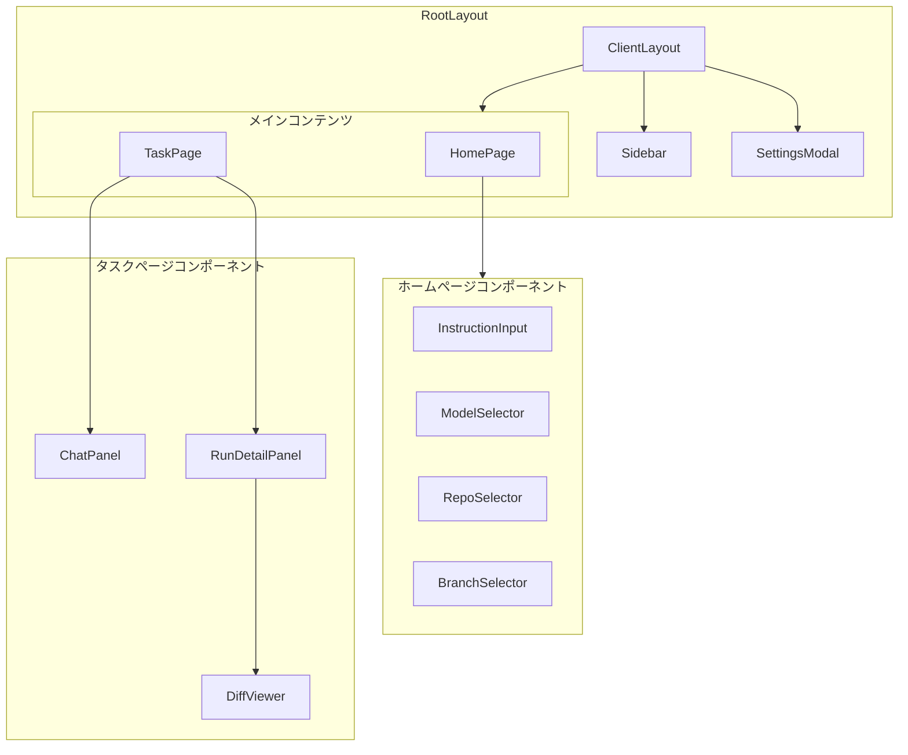
```mermaid
graph TB
    subgraph Layout["RootLayout"]
        ClientLayout["ClientLayout"]

        subgraph Main["メインコンテンツ"]
            HomePage["HomePage"]
            TaskPage["TaskPage"]
        end

        Sidebar["Sidebar"]
        SettingsModal["SettingsModal"]
    end

    subgraph HomeComponents["ホームページコンポーネント"]
        InstructionInput["InstructionInput"]
        ModelSelector["ModelSelector"]
        RepoSelector["RepoSelector"]
        BranchSelector["BranchSelector"]
    end

    subgraph TaskComponents["タスクページコンポーネント"]
        ChatPanel["ChatPanel"]
        RunDetailPanel["RunDetailPanel"]
        DiffViewer["DiffViewer"]
    end

    ClientLayout --> Sidebar
    ClientLayout --> Main
    ClientLayout --> SettingsModal

    HomePage --> HomeComponents
    TaskPage --> ChatPanel
    TaskPage --> RunDetailPanel
    RunDetailPanel --> DiffViewer
```

### 4.3 タスクページレイアウト

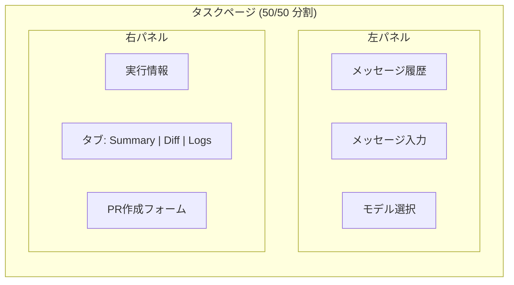
```mermaid
flowchart LR
    subgraph TaskPage["タスクページ (50/50 分割)"]
        subgraph Left["左パネル"]
            Messages["メッセージ履歴"]
            Input["メッセージ入力"]
            Models["モデル選択"]
        end

        subgraph Right["右パネル"]
            RunInfo["実行情報"]
            Tabs["タブ: Summary | Diff | Logs"]
            PRForm["PR作成フォーム"]
        end
    end
```

### 4.4 APIクライアント設計

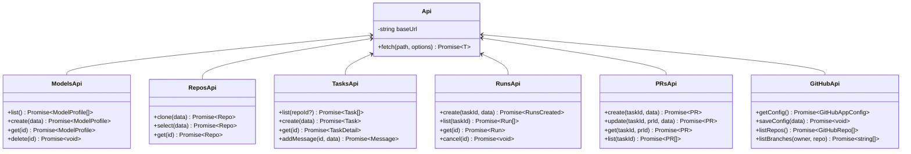
```mermaid
classDiagram
    class Api {
        -string baseUrl
        +fetch(path, options) Promise~T~
    }

    class ModelsApi {
        +list() Promise~ModelProfile[]~
        +create(data) Promise~ModelProfile~
        +get(id) Promise~ModelProfile~
        +delete(id) Promise~void~
    }

    class ReposApi {
        +clone(data) Promise~Repo~
        +select(data) Promise~Repo~
        +get(id) Promise~Repo~
    }

    class TasksApi {
        +list(repoId?) Promise~Task[]~
        +create(data) Promise~Task~
        +get(id) Promise~TaskDetail~
        +addMessage(id, data) Promise~Message~
    }

    class RunsApi {
        +create(taskId, data) Promise~RunsCreated~
        +list(taskId) Promise~Run[]~
        +get(id) Promise~Run~
        +cancel(id) Promise~void~
    }

    class PRsApi {
        +create(taskId, data) Promise~PR~
        +update(taskId, prId, data) Promise~PR~
        +get(taskId, prId) Promise~PR~
        +list(taskId) Promise~PR[]~
    }

    class GitHubApi {
        +getConfig() Promise~GitHubAppConfig~
        +saveConfig(data) Promise~void~
        +listRepos() Promise~GitHubRepo[]~
        +listBranches(owner, repo) Promise~string[]~
    }

    Api <-- ModelsApi
    Api <-- ReposApi
    Api <-- TasksApi
    Api <-- RunsApi
    Api <-- PRsApi
    Api <-- GitHubApi
```

### 4.5 データフェッチング

- **SWR** を使用したStale-While-Revalidate パターン
- タスクページでは2秒間隔でポーリング
- サイドバーのタスク履歴は5秒間隔でリフレッシュ

---

## 5. ドメインモデル

### 5.1 エンティティ関連図 (ER図)

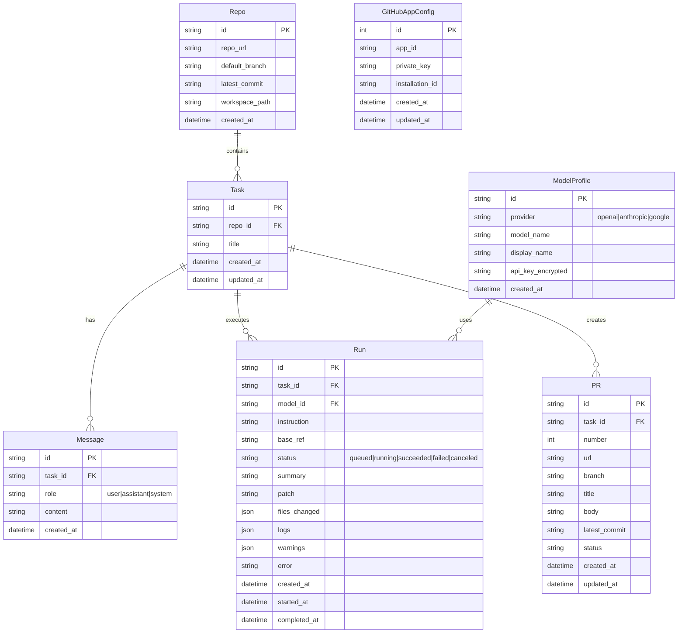
```mermaid
erDiagram
    ModelProfile {
        string id PK
        string provider "openai|anthropic|google"
        string model_name
        string display_name
        string api_key_encrypted
        datetime created_at
    }

    Repo {
        string id PK
        string repo_url
        string default_branch
        string latest_commit
        string workspace_path
        datetime created_at
    }

    Task {
        string id PK
        string repo_id FK
        string title
        datetime created_at
        datetime updated_at
    }

    Message {
        string id PK
        string task_id FK
        string role "user|assistant|system"
        string content
        datetime created_at
    }

    Run {
        string id PK
        string task_id FK
        string model_id FK
        string instruction
        string base_ref
        string status "queued|running|succeeded|failed|canceled"
        string summary
        string patch
        json files_changed
        json logs
        json warnings
        string error
        datetime created_at
        datetime started_at
        datetime completed_at
    }

    PR {
        string id PK
        string task_id FK
        int number
        string url
        string branch
        string title
        string body
        string latest_commit
        string status
        datetime created_at
        datetime updated_at
    }

    GitHubAppConfig {
        int id PK
        string app_id
        string private_key
        string installation_id
        datetime created_at
        datetime updated_at
    }

    Repo ||--o{ Task : "contains"
    Task ||--o{ Message : "has"
    Task ||--o{ Run : "executes"
    Task ||--o{ PR : "creates"
    ModelProfile ||--o{ Run : "uses"
```

### 5.2 列挙型

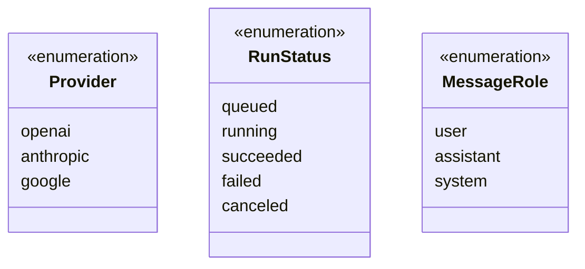
```mermaid
classDiagram
    class Provider {
        <<enumeration>>
        openai
        anthropic
        google
    }

    class RunStatus {
        <<enumeration>>
        queued
        running
        succeeded
        failed
        canceled
    }

    class MessageRole {
        <<enumeration>>
        user
        assistant
        system
    }
```

### 5.3 エージェントインターフェース

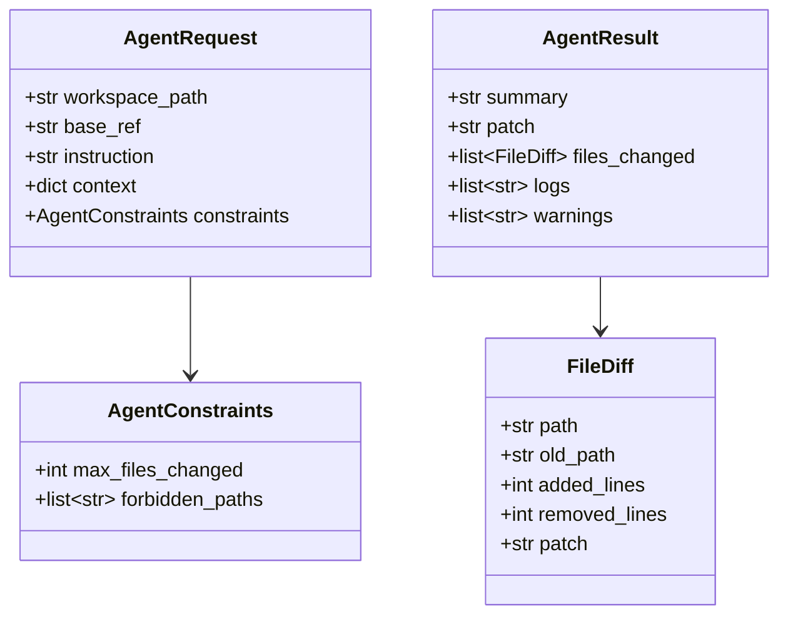
```mermaid
classDiagram
    class AgentRequest {
        +str workspace_path
        +str base_ref
        +str instruction
        +dict context
        +AgentConstraints constraints
    }

    class AgentResult {
        +str summary
        +str patch
        +list~FileDiff~ files_changed
        +list~str~ logs
        +list~str~ warnings
    }

    class AgentConstraints {
        +int max_files_changed
        +list~str~ forbidden_paths
    }

    class FileDiff {
        +str path
        +str old_path
        +int added_lines
        +int removed_lines
        +str patch
    }

    AgentRequest --> AgentConstraints
    AgentResult --> FileDiff
```

---

## 6. データフロー

### 6.1 タスク作成フロー

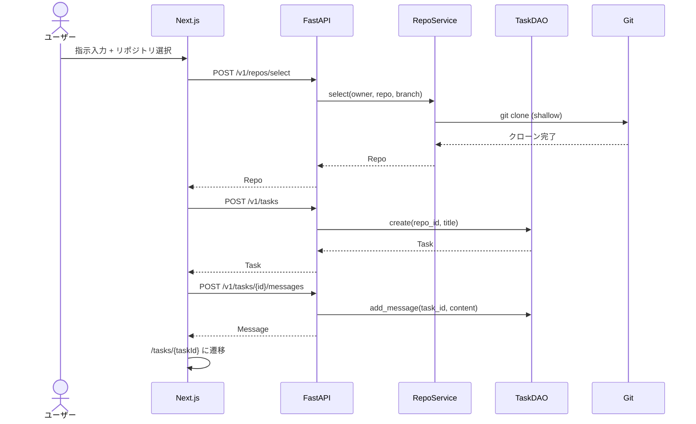
```mermaid
sequenceDiagram
    actor User as ユーザー
    participant Web as Next.js
    participant API as FastAPI
    participant RepoSvc as RepoService
    participant TaskDAO as TaskDAO
    participant Git as Git

    User->>Web: 指示入力 + リポジトリ選択
    Web->>API: POST /v1/repos/select
    API->>RepoSvc: select(owner, repo, branch)
    RepoSvc->>Git: git clone (shallow)
    Git-->>RepoSvc: クローン完了
    RepoSvc-->>API: Repo
    API-->>Web: Repo

    Web->>API: POST /v1/tasks
    API->>TaskDAO: create(repo_id, title)
    TaskDAO-->>API: Task
    API-->>Web: Task

    Web->>API: POST /v1/tasks/{id}/messages
    API->>TaskDAO: add_message(task_id, content)
    API-->>Web: Message

    Web->>Web: /tasks/{taskId} に遷移
```

### 6.2 実行 (Run) フロー

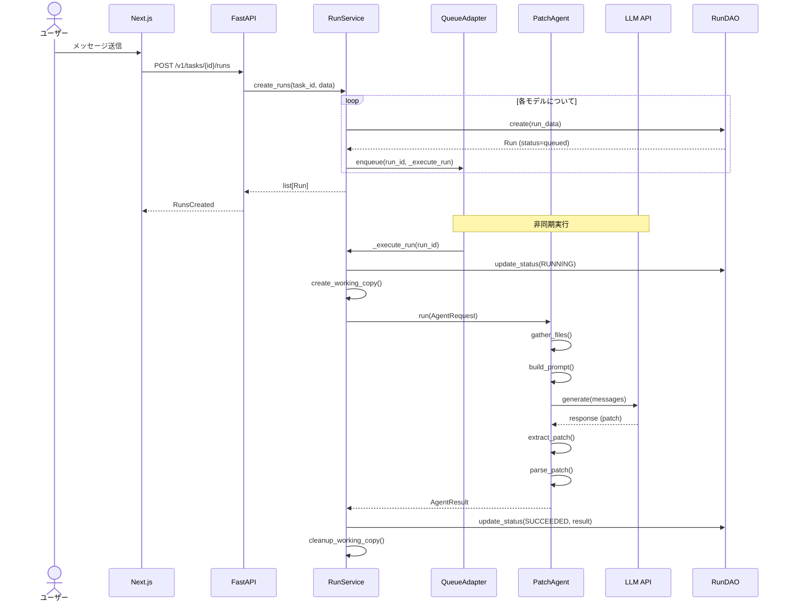
```mermaid
sequenceDiagram
    actor User as ユーザー
    participant Web as Next.js
    participant API as FastAPI
    participant RunSvc as RunService
    participant Queue as QueueAdapter
    participant Agent as PatchAgent
    participant LLM as LLM API
    participant RunDAO as RunDAO

    User->>Web: メッセージ送信
    Web->>API: POST /v1/tasks/{id}/runs
    API->>RunSvc: create_runs(task_id, data)

    loop 各モデルについて
        RunSvc->>RunDAO: create(run_data)
        RunDAO-->>RunSvc: Run (status=queued)
        RunSvc->>Queue: enqueue(run_id, _execute_run)
    end

    RunSvc-->>API: list[Run]
    API-->>Web: RunsCreated

    Note over Queue,LLM: 非同期実行

    Queue->>RunSvc: _execute_run(run_id)
    RunSvc->>RunDAO: update_status(RUNNING)
    RunSvc->>RunSvc: create_working_copy()
    RunSvc->>Agent: run(AgentRequest)
    Agent->>Agent: gather_files()
    Agent->>Agent: build_prompt()
    Agent->>LLM: generate(messages)
    LLM-->>Agent: response (patch)
    Agent->>Agent: extract_patch()
    Agent->>Agent: parse_patch()
    Agent-->>RunSvc: AgentResult
    RunSvc->>RunDAO: update_status(SUCCEEDED, result)
    RunSvc->>RunSvc: cleanup_working_copy()
```

### 6.3 PR作成フロー

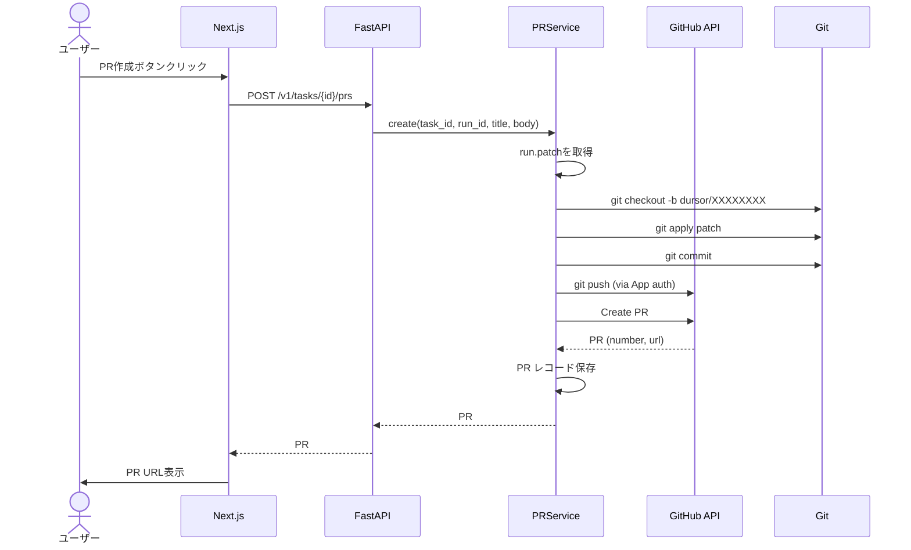
```mermaid
sequenceDiagram
    actor User as ユーザー
    participant Web as Next.js
    participant API as FastAPI
    participant PRSvc as PRService
    participant GitHub as GitHub API
    participant Git as Git

    User->>Web: PR作成ボタンクリック
    Web->>API: POST /v1/tasks/{id}/prs
    API->>PRSvc: create(task_id, run_id, title, body)

    PRSvc->>PRSvc: run.patchを取得
    PRSvc->>Git: git checkout -b dursor/XXXXXXXX
    PRSvc->>Git: git apply patch
    PRSvc->>Git: git commit
    PRSvc->>GitHub: git push (via App auth)
    PRSvc->>GitHub: Create PR
    GitHub-->>PRSvc: PR (number, url)
    PRSvc->>PRSvc: PR レコード保存

    PRSvc-->>API: PR
    API-->>Web: PR
    Web->>User: PR URL表示
```

### 6.4 並列実行モデル

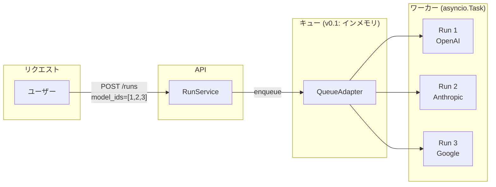
```mermaid
flowchart LR
    subgraph Request["リクエスト"]
        User["ユーザー"]
    end

    subgraph API["API"]
        RunService["RunService"]
    end

    subgraph Queue["キュー (v0.1: インメモリ)"]
        Q["QueueAdapter"]
    end

    subgraph Workers["ワーカー (asyncio.Task)"]
        W1["Run 1<br/>OpenAI"]
        W2["Run 2<br/>Anthropic"]
        W3["Run 3<br/>Google"]
    end

    User -->|"POST /runs<br/>model_ids=[1,2,3]"| RunService
    RunService -->|enqueue| Q
    Q --> W1
    Q --> W2
    Q --> W3
```

---

## 7. API設計

### 7.1 エンドポイント一覧

```mermaid
flowchart LR
    subgraph Models["/v1/models"]
        M1["GET / - 一覧"]
        M2["POST / - 作成"]
        M3["GET /{id} - 取得"]
        M4["DELETE /{id} - 削除"]
    end

    subgraph Repos["/v1/repos"]
        R1["POST /clone - クローン"]
        R2["POST /select - 選択"]
        R3["GET /{id} - 取得"]
    end

    subgraph Tasks["/v1/tasks"]
        T1["GET / - 一覧"]
        T2["POST / - 作成"]
        T3["GET /{id} - 詳細"]
        T4["POST /{id}/messages - メッセージ追加"]
    end

    subgraph Runs["/v1/tasks/{id}/runs"]
        RN1["POST / - 作成"]
        RN2["GET / - 一覧"]
    end

    subgraph RunDetail["/v1/runs"]
        RD1["GET /{id} - 詳細"]
        RD2["POST /{id}/cancel - キャンセル"]
    end

    subgraph PRs["/v1/tasks/{id}/prs"]
        P1["POST / - 作成"]
        P2["GET / - 一覧"]
        P3["GET /{prId} - 詳細"]
        P4["POST /{prId}/update - 更新"]
    end

    subgraph GitHub["/v1/github"]
        G1["GET /config - 設定取得"]
        G2["POST /config - 設定保存"]
        G3["GET /repos - リポジトリ一覧"]
        G4["GET /repos/{owner}/{repo}/branches - ブランチ一覧"]
    end
```

### 7.2 主要リクエスト/レスポンス

#### モデル作成

```
POST /v1/models
Request:
{
    "provider": "openai",
    "model_name": "gpt-4o",
    "display_name": "GPT-4o",
    "api_key": "sk-..."
}

Response:
{
    "id": "uuid",
    "provider": "openai",
    "model_name": "gpt-4o",
    "display_name": "GPT-4o",
    "created_at": "2024-01-01T00:00:00Z"
}
```

#### 実行作成

```
POST /v1/tasks/{task_id}/runs
Request:
{
    "instruction": "Fix the bug in auth.py",
    "model_ids": ["model-1", "model-2"],
    "base_ref": "main"
}

Response:
{
    "run_ids": ["run-1", "run-2"]
}
```

#### PR作成

```
POST /v1/tasks/{task_id}/prs
Request:
{
    "run_id": "run-1",
    "title": "Fix authentication bug",
    "body": "This PR fixes the authentication issue..."
}

Response:
{
    "id": "pr-uuid",
    "number": 42,
    "url": "https://github.com/owner/repo/pull/42",
    "branch": "dursor/abc123",
    "title": "Fix authentication bug",
    "status": "open",
    "created_at": "2024-01-01T00:00:00Z"
}
```

---

## 8. セキュリティ設計

### 8.1 API キー暗号化

```mermaid
flowchart LR
    subgraph Input["入力"]
        Plain["平文APIキー"]
    end

    subgraph Encryption["暗号化"]
        KDF["PBKDF2<br/>(SHA256)"]
        Fernet["Fernet<br/>(AES-128)"]
    end

    subgraph Storage["保存"]
        DB[("SQLite<br/>encrypted")]
    end

    subgraph Decryption["復号"]
        Decrypt["復号処理"]
    end

    subgraph Usage["使用"]
        LLM["LLM API呼び出し"]
    end

    Plain --> Fernet
    EnvKey["DURSOR_ENCRYPTION_KEY"] --> KDF
    KDF --> Fernet
    Fernet --> DB
    DB --> Decrypt
    Decrypt --> LLM
```

| 項目 | 詳細 |
|------|------|
| アルゴリズム | Fernet (対称暗号, AES-128-CBC + HMAC) |
| 鍵導出 | PBKDF2 with SHA256 |
| 保存形式 | Base64エンコード暗号文 |
| 平文の存在 | 実行時メモリ内のみ、オンデマンドで復号 |

### 8.2 GitHub認証

```mermaid
sequenceDiagram
    participant App as dursor
    participant GitHub as GitHub API

    Note over App: 1. JWT生成 (秘密鍵で署名)
    App->>GitHub: POST /app/installations/{id}/access_tokens
    GitHub-->>App: Installation Access Token (1時間有効)

    Note over App: 2. トークンキャッシュ (59分)

    App->>GitHub: API呼び出し (Bearer token)
    GitHub-->>App: レスポンス
```

| 項目 | 詳細 |
|------|------|
| 認証方式 | GitHub App (JWT + Installation Access Token) |
| トークン有効期限 | 1時間 |
| キャッシュ | 59分（1分のバッファ） |
| 必要な権限 | Contents (read/write), Pull requests (read/write) |

### 8.3 ワークスペース分離

```
workspaces/
├── {repo_id}/              # オリジナルクローン（共有）
│   ├── .git/
│   └── src/
├── run_{run_id_1}/         # 実行用コピー（実行後削除）
│   └── src/                # .git なし
├── run_{run_id_2}/
└── ...
```

### 8.4 禁止パス

パッチ生成時に以下のパスへの変更は禁止されます：

```python
forbidden_paths = [
    ".git",
    ".env",
    "*.secret",
    "*.key",
    "credentials.*",
]
```

---

## 9. インフラストラクチャ

### 9.1 Docker Compose構成

```mermaid
flowchart TB
    subgraph DockerCompose["Docker Compose"]
        subgraph API["api (FastAPI)"]
            Port8000[":8000"]
        end

        subgraph Web["web (Next.js)"]
            Port3000[":3000"]
        end
    end

    subgraph Volumes["ボリューム"]
        Workspaces["./workspaces"]
        Data["./data"]
    end

    subgraph External["外部"]
        Browser["ブラウザ"]
        LLM["LLM APIs"]
        GitHub["GitHub API"]
    end

    Browser --> Port3000
    Port3000 --> Port8000
    Port8000 --> LLM
    Port8000 --> GitHub

    API --> Workspaces
    API --> Data
```

### 9.2 環境変数

| 変数 | 説明 | 必須 |
|------|------|------|
| `DURSOR_ENCRYPTION_KEY` | API キー暗号化キー | Yes |
| `DURSOR_GITHUB_APP_ID` | GitHub App ID | Yes* |
| `DURSOR_GITHUB_APP_PRIVATE_KEY` | GitHub App 秘密鍵 (base64) | Yes* |
| `DURSOR_GITHUB_APP_INSTALLATION_ID` | GitHub App Installation ID | Yes* |
| `DURSOR_HOST` | APIサーバーホスト | No |
| `DURSOR_PORT` | APIサーバーポート | No |
| `DURSOR_DEBUG` | デバッグモード | No |
| `DURSOR_LOG_LEVEL` | ログレベル | No |

*GitHub App は環境変数または設定UIで構成可能

---

## 10. 制限事項とロードマップ

### 10.1 v0.1 制限事項

| 制限 | 説明 | 理由 |
|------|------|------|
| **コマンド実行なし** | シェルコマンドは無効化 | セキュリティ上の考慮 |
| **パッチ出力のみ** | エージェントは Unified diff のみ出力 | ファイルシステムへの直接変更を防止 |
| **インメモリキュー** | サーバー再起動で実行中タスクは失われる | シンプルな実装を優先 |
| **シングルプロセス** | 水平スケーリング非対応 | v0.1の範囲制限 |

### 10.2 ロードマップ

```mermaid
gantt
    title dursor ロードマップ
    dateFormat YYYY-MM
    section v0.2
        Docker Sandbox           :v02a, 2024-01, 2024-02
        永続化キュー (Redis)      :v02b, 2024-01, 2024-02
        Review Agent             :v02c, 2024-02, 2024-03
        PRコメントトリガー         :v02d, 2024-02, 2024-03
    section v0.3
        マルチユーザー対応         :v03a, 2024-03, 2024-04
        コスト・予算管理           :v03b, 2024-03, 2024-04
        ポリシーインジェクション    :v03c, 2024-04, 2024-05
```

### 10.3 将来のアーキテクチャ (v0.2+)

```mermaid
flowchart TB
    subgraph Current["現在 (v0.1)"]
        API1["API Server<br/>(単一プロセス)"]
        SQLite1[("SQLite")]
        InMemQ["In-Memory Queue"]
    end

    subgraph Future["将来 (v0.2+)"]
        API2["API Server<br/>(複数インスタンス)"]
        Postgres[("PostgreSQL")]
        Redis["Redis Queue"]
        W1["Worker 1"]
        W2["Worker 2"]
        W3["Worker N"]
        DockerSandbox["Docker Sandbox<br/>(コマンド実行)"]
    end

    API2 --> Postgres
    API2 --> Redis
    Redis --> W1
    Redis --> W2
    Redis --> W3
    W1 --> DockerSandbox
    W2 --> DockerSandbox
    W3 --> DockerSandbox
```

---

## 付録

### A. 技術スタック詳細

| レイヤー | 技術 | バージョン |
|---------|------|-----------|
| フロントエンド | Next.js | 14.x |
| フロントエンド | React | 18.x |
| フロントエンド | TypeScript | 5.x |
| フロントエンド | Tailwind CSS | 3.x |
| フロントエンド | SWR | 2.x |
| バックエンド | Python | 3.11+ |
| バックエンド | FastAPI | 0.100+ |
| バックエンド | Pydantic | 2.x |
| バックエンド | aiosqlite | 0.19+ |
| LLM | openai (Python) | 1.x |
| LLM | anthropic (Python) | 0.x |
| LLM | httpx | 0.x |
| Git | GitPython | 3.x |
| 暗号化 | cryptography | 41.x |
| コンテナ | Docker Compose | 2.x |

### B. 参考リンク

- [FastAPI ドキュメント](https://fastapi.tiangolo.com/)
- [Next.js ドキュメント](https://nextjs.org/docs)
- [GitHub Apps ドキュメント](https://docs.github.com/en/apps)
- [OpenAI API リファレンス](https://platform.openai.com/docs/api-reference)
- [Anthropic API リファレンス](https://docs.anthropic.com/claude/reference)
