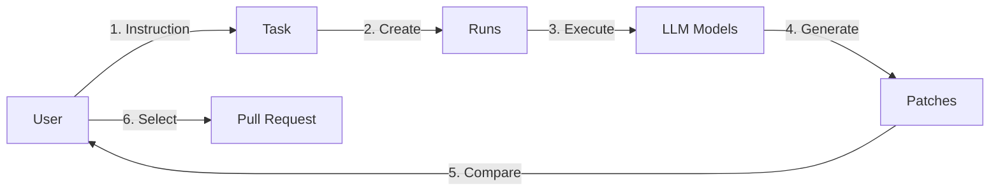

# dursor Documentation

Welcome to the dursor documentation. This guide will help you understand, develop, and contribute to the project.

## Documentation Index

### Getting Started

- [Project Overview](./overview.md) - **Start here** - Comprehensive project summary
- [README](../README.md) - Quick start guide

### Architecture & Design

- [System Architecture](./architecture.md) - System design and patterns
- [Agent System](./agents.md) - Agent architecture and LLM integration
- [UI/UX Improvement Plan](./ui-ux-improvement.md) - Frontend design roadmap

### Reference

- [API Reference](./api.md) - Complete REST API documentation
- [Development Guide](./development.md) - Environment setup and workflow

### For Contributors

- [Contributing Guide](../CONTRIBUTING.md) - How to contribute to the project
- [CLAUDE.md](../CLAUDE.md) - Context file for Claude Code development

## Quick Links

### Getting Started

```bash
# Clone repository
git clone https://github.com/your-org/dursor.git
cd dursor

# Backend setup
cd apps/api
python -m venv .venv
source .venv/bin/activate
pip install -e ".[dev]"

# Frontend setup
cd ../web
npm install

# Start development
docker compose up -d --build
```

### Key Concepts



### Project Structure

```
dursor/
├── apps/
│   ├── api/          # FastAPI backend
│   └── web/          # Next.js frontend
├── docs/             # Documentation
├── workspaces/       # Git clones (runtime)
├── data/             # SQLite database (runtime)
└── docker-compose.yml
```

## Version History

| Version | Status | Description |
|---------|--------|-------------|
| v0.1 | Current | MVP with patch generation and PR creation |
| v0.2 | Planned | Docker sandbox, GitHub App auth |
| v0.3 | Planned | Multi-user, cost management |

## Support

- **Issues**: [GitHub Issues](https://github.com/your-org/dursor/issues)
- **Discussions**: [GitHub Discussions](https://github.com/your-org/dursor/discussions)
