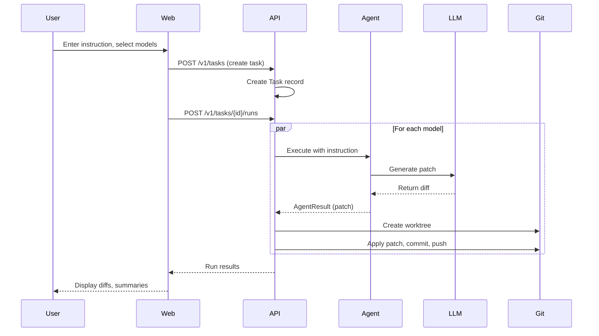
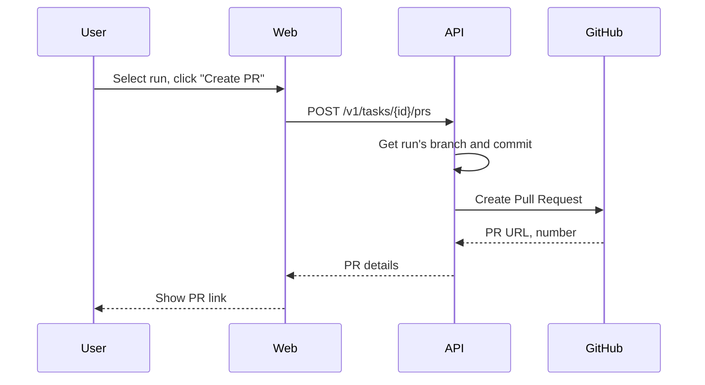
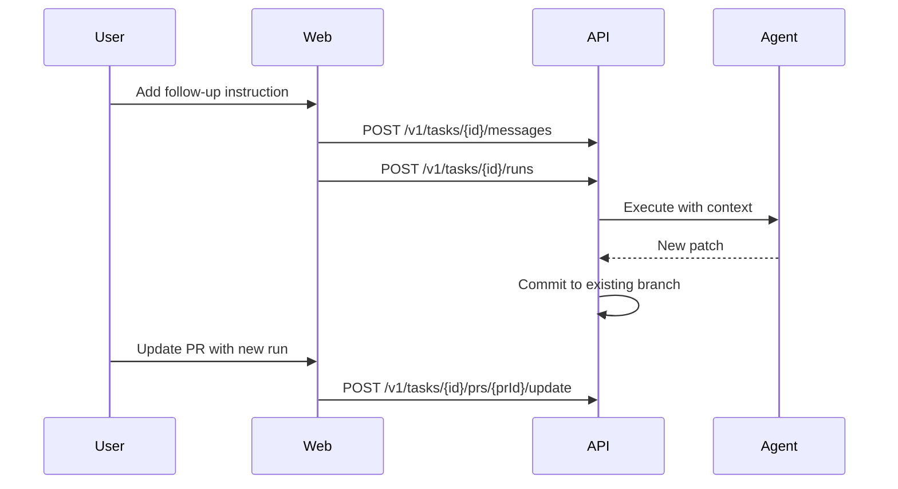

# dursor - Comprehensive Overview

## What is dursor?

**dursor** is a self-hostable multi-model parallel coding agent that automates code generation and modification tasks. It orchestrates multiple AI models to work on the same task simultaneously, allowing users to compare results and create pull requests from the best output.

### Key Value Propositions

1. **BYO API Key**: Users bring their own API keys (OpenAI, Anthropic, Google)
2. **Multi-Model Parallel Execution**: Run the same task on multiple LLMs simultaneously and compare results
3. **Conversation-Driven PR Development**: Iteratively refine changes through chat and grow PRs organically
4. **Pluggable Executors**: Support for LLM-based patch generation and CLI tools (Claude Code, Codex, Gemini)
5. **Orchestrator Management Pattern**: dursor manages all git operations while agents only edit files

---

## Architecture at a Glance

```
┌─────────────────────────────────────────────────────────────────────────┐
│                            Web UI (Next.js 14)                          │
│  ┌─────────────┐  ┌──────────────┐  ┌─────────────┐  ┌──────────────┐  │
│  │  Home Page  │  │  Task Detail │  │  Settings   │  │   Sidebar    │  │
│  │ (Task Form) │  │  (Chat+Diff) │  │   Modal     │  │ (Navigation) │  │
│  └─────────────┘  └──────────────┘  └─────────────┘  └──────────────┘  │
└─────────────────────────────────────────────────────────────────────────┘
                                    │
                                    │ REST API
                                    ▼
┌─────────────────────────────────────────────────────────────────────────┐
│                         API Server (FastAPI)                            │
│  ┌─────────────┐  ┌──────────────┐  ┌─────────────┐  ┌──────────────┐  │
│  │   Routes    │──│   Services   │──│   Agents    │──│  Executors   │  │
│  │  (REST)     │  │  (Business)  │  │   (LLM)     │  │   (CLI)      │  │
│  └─────────────┘  └──────────────┘  └─────────────┘  └──────────────┘  │
│  ┌─────────────┐  ┌──────────────┐                                     │
│  │   Storage   │──│  DAOs        │                                     │
│  │  (SQLite)   │  │  (Data)      │                                     │
│  └─────────────┘  └──────────────┘                                     │
└─────────────────────────────────────────────────────────────────────────┘
                                    │
                    ┌───────────────┼───────────────┐
                    │               │               │
                    ▼               ▼               ▼
             ┌──────────┐   ┌────────────┐   ┌────────────┐
             │  SQLite  │   │  LLM APIs  │   │  GitHub    │
             │  (Data)  │   │  (OpenAI,  │   │  (PR/Repo) │
             │          │   │  Anthropic,│   │            │
             │          │   │  Google)   │   │            │
             └──────────┘   └────────────┘   └────────────┘
```

---

## Core Concepts

### Entities

| Entity | Description |
|--------|-------------|
| **ModelProfile** | LLM configuration: provider + model + encrypted API key |
| **Repo** | Git repository cloned for code editing |
| **Task** | Conversation unit representing a single goal/feature |
| **Message** | Chat message within a Task (user/assistant/system) |
| **Run** | Single execution of an agent on a Task |
| **PR** | Pull Request created from a Run's changes |

### Execution Model

```
User Instruction
      │
      ▼
┌─────────────────┐
│     Task        │   ← Conversation container
└────────┬────────┘
         │
         │ (parallel)
         ├──────────────┬──────────────┬──────────────┐
         ▼              ▼              ▼              ▼
    ┌─────────┐    ┌─────────┐    ┌─────────┐    ┌─────────┐
    │  Run 1  │    │  Run 2  │    │  Run 3  │    │  Run N  │
    │ (GPT-4) │    │ (Claude)│    │ (Gemini)│    │  (...)  │
    └────┬────┘    └────┬────┘    └────┬────┘    └────┬────┘
         │              │              │              │
         ▼              ▼              ▼              ▼
    ┌─────────┐    ┌─────────┐    ┌─────────┐    ┌─────────┐
    │ Patch A │    │ Patch B │    │ Patch C │    │Patch ...│
    └─────────┘    └─────────┘    └─────────┘    └─────────┘
         │
         ▼
    User selects best patch → Create PR
```

### Orchestrator Management Pattern

dursor follows an **orchestrator management pattern** where:

1. **Agents only edit files** - they cannot run git commands
2. **dursor manages all git operations** - commits, branches, pushes
3. **Constraints are enforced** - forbidden paths, command restrictions

This ensures:
- Consistent git history
- Security (no arbitrary command execution)
- Predictable behavior across different agent types

---

## Tech Stack

| Component | Technology | Purpose |
|-----------|------------|---------|
| Backend | FastAPI (Python 3.11+) | REST API server |
| Frontend | Next.js 14 (React, TypeScript) | Web UI |
| Styling | Tailwind CSS | Utility-first CSS |
| Database | SQLite (aiosqlite) | Data persistence |
| Data Fetching | SWR | Client-side caching |
| LLM Providers | OpenAI, Anthropic, Google | AI model access |
| Git Integration | GitHub App | Repository/PR management |

---

## Directory Structure

```
dursor/
├── apps/
│   ├── api/                        # Backend (FastAPI)
│   │   ├── pyproject.toml          # Python dependencies
│   │   ├── Dockerfile
│   │   └── src/dursor_api/
│   │       ├── main.py             # App entrypoint
│   │       ├── config.py           # Environment config
│   │       ├── dependencies.py     # FastAPI DI
│   │       ├── agents/             # LLM agents
│   │       │   ├── base.py         # Abstract agent
│   │       │   ├── patch_agent.py  # Patch generator
│   │       │   └── llm_router.py   # Multi-provider client
│   │       ├── executors/          # CLI executors
│   │       │   ├── base_executor.py
│   │       │   ├── claude_code_executor.py
│   │       │   ├── codex_executor.py
│   │       │   └── gemini_executor.py
│   │       ├── domain/             # Domain models
│   │       │   ├── enums.py
│   │       │   └── models.py
│   │       ├── routes/             # API endpoints
│   │       │   ├── models.py       # /v1/models
│   │       │   ├── repos.py        # /v1/repos
│   │       │   ├── tasks.py        # /v1/tasks
│   │       │   ├── runs.py         # /v1/runs
│   │       │   ├── prs.py          # /v1/prs
│   │       │   └── github.py       # /v1/github
│   │       ├── services/           # Business logic
│   │       │   ├── crypto_service.py
│   │       │   ├── model_service.py
│   │       │   ├── repo_service.py
│   │       │   ├── run_service.py
│   │       │   ├── pr_service.py
│   │       │   ├── git_service.py
│   │       │   ├── github_service.py
│   │       │   └── run_log_service.py
│   │       └── storage/            # Data layer
│   │           ├── schema.sql      # DB schema
│   │           ├── db.py           # Connection
│   │           └── dao.py          # Data access
│   │
│   └── web/                        # Frontend (Next.js)
│       ├── package.json
│       ├── Dockerfile
│       ├── next.config.js
│       └── src/
│           ├── app/                # App Router pages
│           │   ├── layout.tsx
│           │   ├── page.tsx        # Home
│           │   ├── settings/       # Settings
│           │   └── tasks/[taskId]/ # Task detail
│           ├── components/         # React components
│           │   ├── ChatCodeView.tsx
│           │   ├── ChatPanel.tsx
│           │   ├── RunsPanel.tsx
│           │   ├── RunDetailPanel.tsx
│           │   ├── DiffViewer.tsx
│           │   └── ui/             # Base components
│           ├── lib/
│           │   ├── api.ts          # API client
│           │   └── utils.ts
│           └── types.ts            # TypeScript types
│
├── docs/                           # Documentation
├── workspaces/                     # Git clones (runtime)
├── data/                           # SQLite DB (runtime)
├── docker-compose.yml
├── .env.example
└── CLAUDE.md                       # Development context
```

---

## Key Workflows

### 1. Task Creation and Execution



### 2. PR Creation



### 3. Iterative Refinement



---

## Executor Types

dursor supports multiple executor types for different use cases:

| Executor | Type | Use Case |
|----------|------|----------|
| **Patch Agent** | LLM | Direct patch generation via API |
| **Claude Code** | CLI | Full Claude Code capabilities |
| **Codex CLI** | CLI | OpenAI Codex CLI integration |
| **Gemini CLI** | CLI | Google Gemini CLI integration |

### Executor Lock

Once a Task uses a specific executor type, it's locked to that type for conversation consistency. This ensures that follow-up instructions use the same agent with full context.

---

## Security Model

### API Key Encryption
- Keys encrypted at rest using Fernet (AES-128)
- Encryption key from `DURSOR_ENCRYPTION_KEY` environment variable

### Forbidden Paths
Agents cannot modify:
- `.git` directories
- `.env` files and variants
- `*.key`, `*.pem`, `*.secret` files

### Forbidden Commands
Agents cannot run git write operations:
- `git commit`, `git push`, `git checkout`
- `git reset --hard`, `git rebase`, `git merge`

### GitHub App Authentication
- Uses GitHub App for repository access and PR creation
- Requires `Contents` (read/write) and `Pull requests` (read/write) permissions

---

## v0.1 Limitations

The current version has intentional limitations:

1. **No command execution** - Agents output patches only, no shell commands
2. **Single-instance** - In-memory queue, single process execution
3. **SQLite** - Single-file database, not distributed

---

## Roadmap

### v0.2 (Planned)
- Docker sandbox for safe command execution
- Review/Meta agent for comparing runs
- PR comment-triggered re-runs
- Distributed task queue (Celery/RQ)

### v0.3 (Planned)
- Multi-user support with authentication
- Cost and budget management
- Policy injection for access control
- PostgreSQL support for scalability

---

## Quick Start

### Prerequisites
- Python 3.11+
- Node.js 20+
- Git
- Docker (optional)

### Local Development

```bash
# Clone
git clone https://github.com/your-org/dursor.git
cd dursor

# Backend
cd apps/api
python -m venv .venv
source .venv/bin/activate
pip install -e ".[dev]"
python -m dursor_api.main

# Frontend (new terminal)
cd apps/web
npm install
npm run dev
```

### Docker

```bash
cp .env.example .env
# Edit .env with your settings
docker compose up -d --build
```

Access at http://localhost:3000

---

## Related Documentation

- [Architecture Design](./architecture.md) - Detailed system architecture
- [API Reference](./api.md) - Complete REST API documentation
- [Agent System](./agents.md) - Agent implementation details
- [Development Guide](./development.md) - Setup and development workflow
- [UI/UX Improvement Plan](./ui-ux-improvement.md) - Frontend enhancement roadmap
